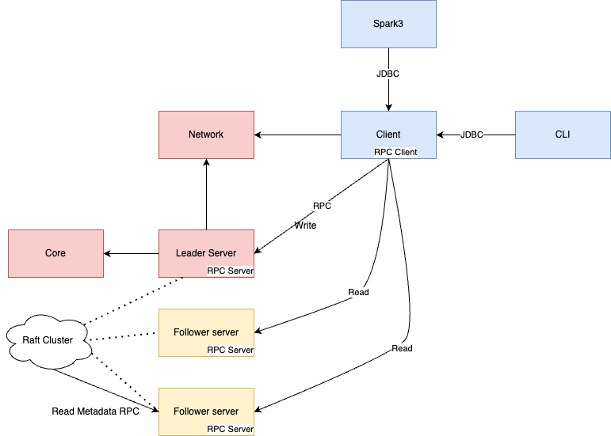

## 构建环境

1. Scala 3.x
2. Kotlin 1.8.x
3. Java 11+ （Amazon Corretto JDK 11 或 Open JDK 17）
4. Mac、Linux、Windows（需要使用profile，并且不可读写数据，需要使用Docker）

## 模块概述

***核心模块依赖关系***



- `bitlap-cli`       交互式命令行实现。技术栈：scala 3.x、zio-cli
- `bitlap-client`    JDBC和RPC client实现。技术栈：scala 3.x、zio-grpc
- `bitlap-network`   RPC client和server的抽象定义。技术栈：scala 3.x、zio 2.x
- `bitlap-server`    RPC server实现、raft server实现、HTTP server实现。技术栈：scala 3.x、jraft、zio-grpc、zio-http
- `bitlap-core`      SQL解析、优化、任务、存储。技术栈：kotlin
- `bitlap-spark3`    与spark3集成。技术栈：spark 3.x、scala 2.13.x
- `bitlap-common`    公共模块。技术栈：kotlin
- `bitlap-testkit`   测试工具和集成测试模块。技术栈：scala 3.x、javafaker
- `bitlap-server-ui` 可视化SQL执行页面的UI

## 快速开始

1. 安装IDEA插件（可选） [IDEA Plugin Scala-Macro-Tools](https://github.com/bitlap/scala-macro-tools)
2. 下载源码 `git clone https://github.com/bitlap/bitlap.git`
3. `mvn package -Pwebapp`
4. 运行 `org.bitlap.server.BitlapServer` 在Java8+以上中需要添加虚拟机参数，请参考`bin/bitlap-env.sh`中的`# JDK11="......"`
5. 访问 `http://localhost:18081`

## 打包

1. 打包脚本：`dev/make-tarball.sh` （以Java11为准）
2. 运行：`/bin/bitlap server start`，默认Java11。（在Java8上请去掉`bin/bitlap-env.sh`中的`# JDK11="......"`这个参数）

## docker打包&运行

> tag就是版本号，如：0.4.0-SNAPSHOT
```
# 打包
cd docker;sh docker.sh 0.4.0-SNAPSHOT
# 运行 
docker run --name bitlap:0.4.0-SNAPSHOT -dit -p 18081:18081 -p 23333:23333 -p 12222:12222  bitlap:0.4.0-SNAPSHOT
```
- 访问 `http://localhost:18081`