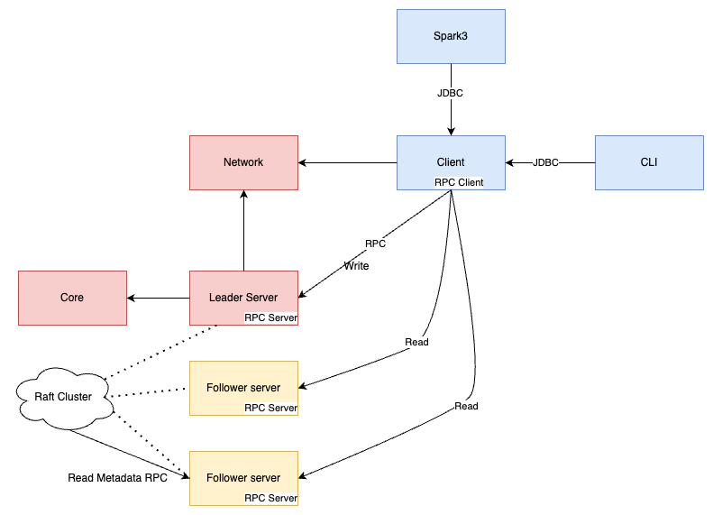

## 构建环境

1. Scala 2.13.x
2. Kotlin 1.7.x
3. Java 11+
4. Mac、Linux、Windows（需要使用profile）

## 模块概述

***核心模块依赖关系***

- `bitlap-cli`       交互式命令行实现。技术栈：scala、zio-cli
- `bitlap-client`    JDBC和RPC client实现。技术栈：scala、zio-grpc
- `bitlap-network`   RPC client和server的抽象定义。技术栈：scala、zio
- `bitlap-server`    RPC server实现、raft server实现、HTTP server实现。技术栈：scala、zio-raft、zio-grpc、zio-http(zhttp)
- `bitlap-core`      SQL解析、优化、任务、存储。技术栈：kotlin
- `bitlap-spark3`    与spark3集成。技术栈：spark3、scala
- `bitlap-common`    公共模块。技术栈：kotlin
- `bitlap-testkit`   测试工具和集成测试模块。技术栈：scala、javafaker

## 快速开始

> windows上无法运行

1. 安装IDEA插件（可选） [IDEA Plugin Scala-Macro-Tools](https://github.com/bitlap/scala-macro-tools)
2. 下载源码 `git clone https://github.com/bitlap/bitlap.git`
3. 找到类 `bitlap-server/src/main/scala/../.../BitlapServer.scala`，然后在IDEA中运行该main方法。（Java 9以上需要JVM参数：`--add-exports
   java.base/jdk.internal.ref=ALL-UNNAMED`）
4. 浏览器中请求 `http://localhost:8080/init` ，以初始化数据。（使用的数据在`bitlap-server/src/main/resources/simple_data.csv`）
5. 浏览器中请求：`http://localhost:8080/sql` ，该接口使用固定的SQL查数并返回。

## 修改默认数据
- 目前仅能通过classpath导入csv，所以csv在server中，想修改csv得这样操作：
  1. 使用`bitlap-testkit/src/test/scala/.../GenerateFakeData.scala`
     工具生成csv文件，生成的文件在`bitlap-testkit/src/test/resources/.../simple_data.csv`
  2. 将生成的csv拷贝到`bitlap-server/src/main/resources/simple_data.csv`
  3. `http://localhost:8080/init` ，再次初始化数据
