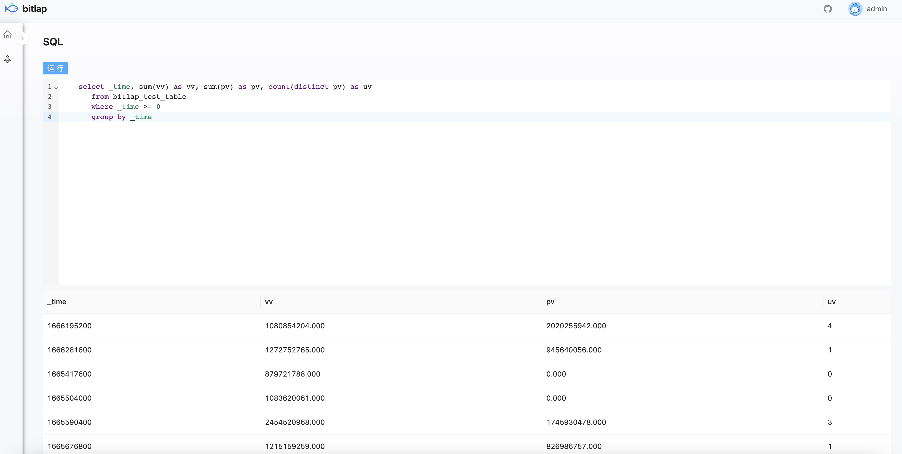

# bitlap

> 龟速开发中，感兴趣的可以star一下

![CI][Badge-CI]  [![codecov][Badge-Codecov]][Link-Codecov]  

## 架构

## 演示

## 在线测试

`http://im.dreamylost.cn:18081`

## 如何贡献

[CONTRIBUTING](./CONTRIBUTING.md)

## 许可

[LICENSE](./LICENSE)

[Stage]: https://img.shields.io/badge/Project%20Stage-Development-yellowgreen.svg

[Badge-CI]: https://github.com/bitlap/bitlap/actions/workflows/ci.yml/badge.svg

[Badge-Maven]: https://img.shields.io/maven-central/v/org.bitlap/bitlap

[Badge-Discord]: https://img.shields.io/discord/968687999862841384

[Badge-Codecov]: https://codecov.io/gh/bitlap/bitlap/branch/dev/graph/badge.svg?token=9XJ2LC2K8M

[Badge-Snapshots]: https://img.shields.io/nexus/s/org.bitlap/bitlap-core?server=https%3A%2F%2Fs01.oss.sonatype.org

[Link-Discord]: https://discord.com/invite/vp5stpz6eU

[Link-Codecov]: https://codecov.io/gh/bitlap/bitlap

[Link-Maven]: https://search.maven.org/search?q=g:%22org.bitlap%22%20AND%20a:%22bitlap%22

[Link-Snapshots]: https://s01.oss.sonatype.org/content/repositories/snapshots/org/bitlap/
