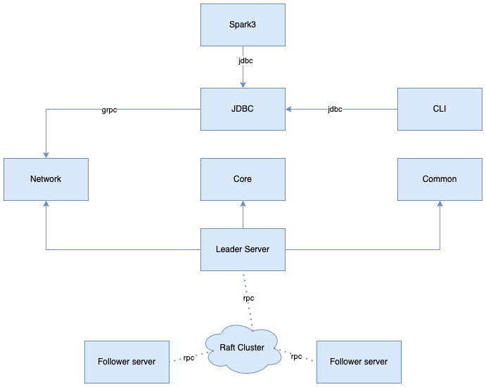

## 构建环境

1. Scala 3.x、Scala 2.13.x
2. Java 11+ （Amazon Corretto JDK 11 或 Open JDK 17）
3. Linux、Mac、Windows（暂时不支持读写数据）、Docker

## 演示


## 架构


## 模块概述

***核心模块依赖关系***



| 模块               | 技术栈                                     | 说明                                         |
|------------------|-----------------------------------------|--------------------------------------------|
| bitlap-cli       | scala 3.x、zio-cli、 sqlline              | 交互式命令行                                     |
| bitlap-client    | scala 3.x                               | JDBC                                       |
| bitlap-protobuf  | zio-grpc、protobuf-java                  | 所有 protobuf 定义，含 Scala 和 Java（仅供 jraft 使用） |
| bitlap-network   | scala 3.x、zio 2.x、 tagless final        | 大部分模型定义、网络协议抽象及其默认实现、Client 默认实现           |
| bitlap-server    | scala 3.x、jraft、zio-grpc、zio-http、tapir | 会话、调度、配置、Rpc、Raft、HTTP                     |
| bitlap-core      | scala 3.x、calcite、parquet               | SQL 解析、优化、任务、存储                            |
| bitlap-spark3    | scala 2.13.x、spark 3.x                  | Spark3 集成                                  |
| bitlap-common    | scala 3.x、 RoaringBitmapX               | 工具、 配置、异常、基础模型                             |
| bitlap-testkit   | scala 3.x、javafaker、rolls、scalatest     | 测试工具、集成测试                                  |
| bitlap-server-ui | umi                                     | 可视化 SQL 页面 UI                              |

## 运行

> $tag就是版本号，如：0.4.0-alpha1
```
# 打包、构建镜像、运行（默认不运行）
cd docker;sh deploy.sh $tag
# 运行
docker run --name bitlap-$tag -dit -p 24333:24333 -p 23333:23333 -p 22333:22333  liguobin/bitlap:$tag
```
访问 `http://localhost:22333`

也可以使用打包好的 [镜像](https://hub.docker.com/r/liguobin/bitlap/tags)

> 暂不建议本地直接启动`main`方法运行
